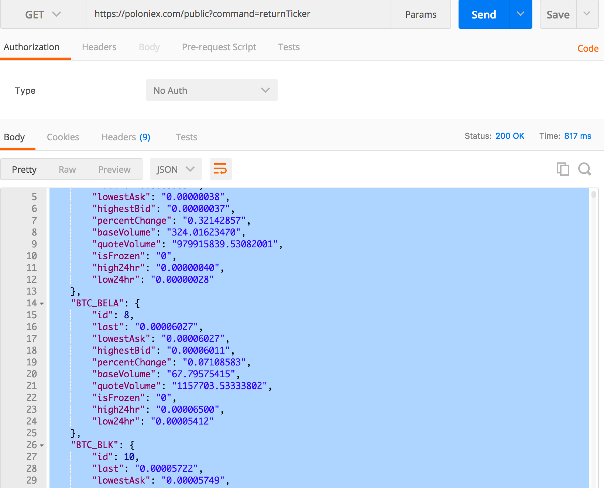

# use 


### set environment 
``` bash
$ nvm install 8.3.0
$ npm install -g yarn
$ yarn init
$ yarn global add eslint
    # npm install -g eslint
$ eslint -init
    #   - use poppular style
    #   - Airbnb
    #   - React NO
    #   - Javascript    
$ yarn add --dev eslint     // eslint는 로컬에도 설치가 되어있으면 좋다.
$ yarn add --dev nodemon
$ yarn add dotenv  
    # 이 폴더 들어가면 자동으로 환경변수를 저장할 수 있다. 나는 pyenv 도 같이 쓰고 있어서 
    # 특정 디렉ㄷ토리를 들어갈때 .env 에 작성된 내용의 스크립트 마저도 실행할 수 있다.
$ yarn add koa 
$ yarn add mongoose
$ yarn add koa-router  
$ yarn add axios
```
### 준비
    1. jsconfig.json 
        - vscode 에서 자동완성 기능을 제공할 때 기존 작성한 소스를 가져오는 디렉토리를 지정할 수 있는데..., js 코딩에 관련된 설정을 읽는 역할을 한다.
        - crawler > index.js 에서  require('../lib/poloniex') 로 쓰기가 싫고  require('lib/poloniex')로 작성하고싶어서 저렇게 작성함
        - 강의 EP03 30:00 참조 / 상대경로 설정 안해도됨. 인털리센스  자동으로 됨
        - package.json 에서   scripts-> crawler:dev : "NODE_PATH=src nodemon src/crawler/index.js" 에서 NODE_PATH를 이용해야함.
    2. mongoDB turn on
        > cd ${project}/server && docker-compose -f docker-compose.dev.yml up --build 

## notice
$npm install 과  $yarn install 의 차이는. 그 당시 설치했던 node 패키지를 다운받도록 도와준다. yarn.lock이 그런 기능을 함.
package-lock.json / yarn-lock 이 둘의 기능은 그 당시 설치했던 노드 패키지를 다운받도록 도와줌.


## reference
    1. REST ful API versioning design 
        - 버저닝을 하는 이유는 url이 같으면 같은 주소로의 요청이 캐싱되어버려서 업데이트를 해도 변하지 않을 수 있다.
        - https://stackoverflow.com/questions/389169/best-practices-for-api-versioning#

    2. 정보 활용하기
        - postman : https://poloniex.com/public?command=returnTicker
        - 홈페이지를 보니 여기에서 데이터를 가지고 오고 있었다.
            
        - BTC_BEP 의 last property가 환율을 나타낸다.

    3. 몽고 4.11.x에서 connect 와 createConnection 함수에 대한 deceprate의 문제.
        - https://stackoverflow.com/questions/40818016/connect-vs-createconnection 참조